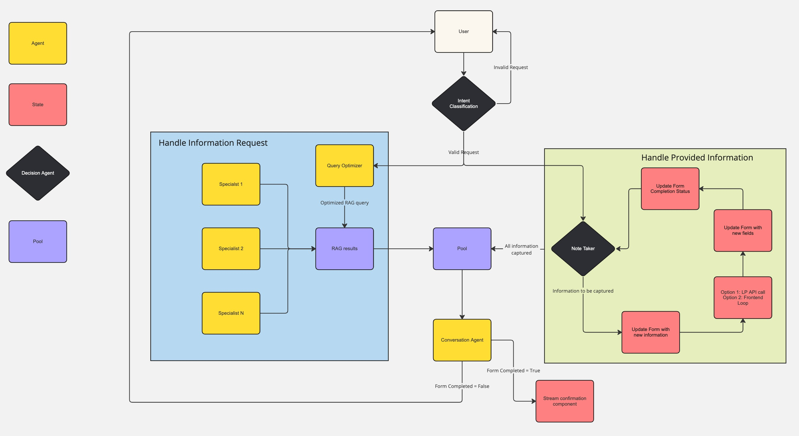

# Procurement Chatbot (Backend)

## Description

This is the backend for the Procurement Chatbot. It is a FastAPI app that uses OpenAI's GPT-4 to generate responses to user queries. These responses are parsed to fill a form that is then sent to the procurement team.

## How to run

1. Create an .env file with OpenAI API key

    ```bash
    cp .env.example .env
    ```

    Make sure to add all necessary secrets to  the .env.

2. Install app dependencies (remove --with dev if you don't want to install dev dependencies)

    Poetry

    ```bash
    poetry install --with dev
    poetry run app
    ```

    Docker

    ```bash
    docker compose up --build
    ```

    visit <http://localhost:8089> for a simple UI or <http://localhost:8089/docs> for FastAPI endpoints

## Project Structure

```bash
.
├── Dockerfile                  
├── README.md                   
├── docker-compose.dev.yml      # Only use for development
├── docker-compose.yml          # deployment docker
├── flowchart.jpg               # Visual representation of the application flow
├── pip.conf                    # for docker to use nexus pip index
├── pyproject.toml              # Poetry configuration file
├── ruff.toml                   # Configuration file for Ruff (Python linter)
└── procurement
    ├── __init__.py
    ├── main.py                 # Main entry point of the application (FastAPI app)
    ├── agents                  
    │   ├── __init__.py
    │   ├── agents_manager.py   # Manages different types of agents
    │   ├── base_agent.py       # Base class for all agents
    │   ├── conversation_agent.py
    │   ├── intent_agent.py
    │   └── note_taking_agent.py
    ├── api                     s
    │   ├── __init__.py
    │   ├── api_router.py       # Main API router
    │   ├── deps.py             # Dependency injection for API (Database connection)
    │   └── endpoints           # Individual API endpoints
    │       ├── __init__.py
    │       ├── chat.py
    │       ├── check.py
    │       ├── sessions.py
    │       └── uuid.py
    ├── db                      
    │   ├── __init__.py         # initiate an async database connection
    │   ├── db_check.py         # Database health check
    │   ├── db_operations.py    # CRUD operations
    │   ├── db_tables.py        # Database table definitions
    │   └── init.pgsql          # Initial SQL for database setup
    ├── models                  
    │   ├── __init__.py
    │   ├── exceptions.py       # Custom exception classes
    │   ├── requests.py         # Request models
    │   └── responses.py        # Response models
    ├── schemas
    │   └── main.json           # TODO: will be replaced by LP connection
    ├── static                  # UI
    │   ├── script.js
    │   └── styles.css
    ├── templates               # UI
    │   └── index.html          
    └── utils                   
        ├── __init__.py
        ├── config.py           # Secret configuration
        ├── form_handler.py     
        └── text_handler.py     
```

## Agent Interactions

The diagram below explains the interaction between agents


